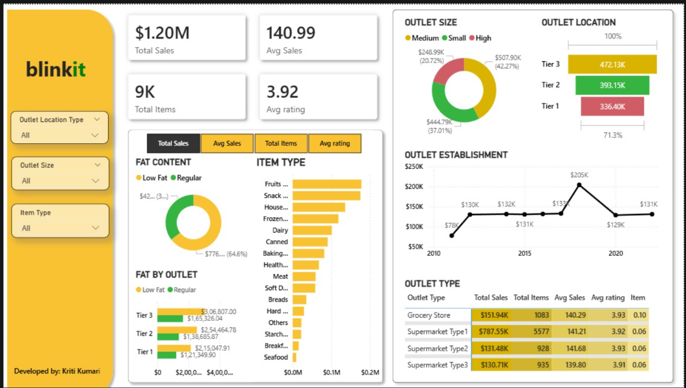

#  Blinkit Sales Performance Dashboard

## About the Project  
This project analyzes the sales performance of Blinkit across different outlets and product categories using an interactive Power BI dashboard. The objective is to understand sales behavior, consumer health preferences, and the impact of outlet size and location on overall revenue.

The dashboard transforms raw retail sales data into meaningful insights that can support better inventory planning, outlet expansion, and strategic decision-making.

---

## Tools Used  
- **MS Excel** – Initial data review and basic data cleaning  
- **Power Query** – Data transformation and preprocessing  
- **Power BI** – Data modeling, DAX calculations, and interactive dashboard creation  

---

## Key Business Metrics  
- **Total Sales:** $1.20M  
- **Average Sales per Transaction:** $140.99  
- **Total Items Sold:** 9,000  
- **Average Customer Rating:** 3.92 / 5  

These KPIs provide a quick snapshot of business scale, customer satisfaction, and transaction value.

---

## Dashboard Insights  

###  Product & Consumer Analysis  
- Sales comparison between **Low Fat** and **Regular** products  
- Category-wise sales performance including Fruits, Snacks, Household items, and more  

###  Outlet Performance  
- Revenue analysis by **Outlet Size** (Small, Medium, High)  
- Sales distribution across **Location Tiers** (Tier 1, Tier 2, Tier 3)  

###  Growth & Efficiency  
- Outlet establishment trend from **2010 onwards**  
- Performance comparison between Grocery Stores and different Supermarket types  

---

## Key Observations  
- **Top Categories:** Fruits and Snacks are the highest revenue-generating categories  
- **Health Preference:** Low Fat products contribute nearly **65% of total sales**, showing strong health-conscious consumer behavior  
- **Location Impact:** Tier 3 cities outperform Tier 1 and Tier 2 in total revenue  
- **Outlet Efficiency:** Medium-sized outlets contribute over **42% of total sales**  
- **Growth Pattern:** Peak performance around 2018 followed by stable growth in recent years  

---

## Business Takeaways  
- **Inventory Optimization:** Focus on stocking high-demand categories like Fruits and Snacks  
- **Health-Focused Marketing:** Continue promoting Low Fat and wellness-oriented products  
- **Expansion Strategy:** Tier 3 locations present strong opportunities for future expansion  
- **Performance Review:** Similar performance of Supermarket Type 2 and Type 3 suggests scope to improve Type 1 efficiency  

---

## Dashboard Features  
- **Interactive Slicers:** Filter data by outlet size, location tier, and item category  
- **Cross-Filtering:** Selecting any visual dynamically updates all related visuals  
- **Comparative Tables:** Data bars and visuals allow quick outlet performance comparison  

---

## Dashboard Preview  

---

## Created By  
**Kriti Kumari**
